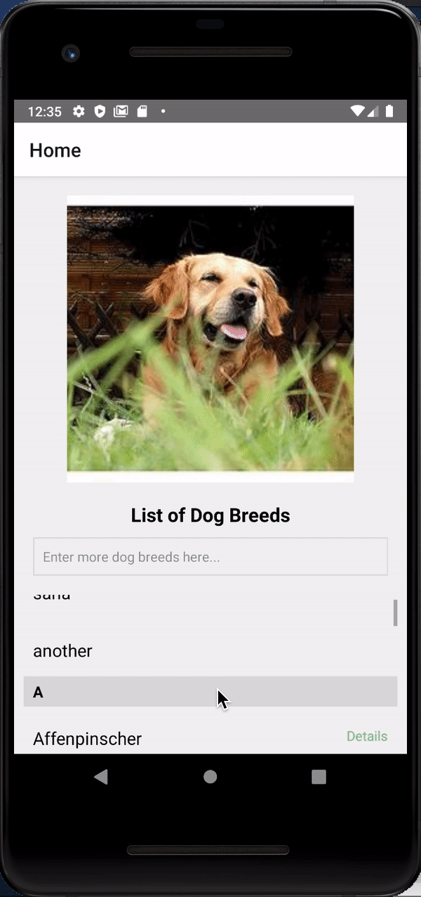

# Dog Breeds

I'm learning react native! In order to learn the basic concepts of the framework, I decided to create an app that shows a list of dog breeds. You can scroll through a list of dog breeds and click on one to see a random image of that breed! You can also add your own dog breeds to the list. I created this app to learn how to use an API, get familiar with list views, and also learn how to use react navigation.

Feature to see a random dog image:

Feature to add your own breed:

